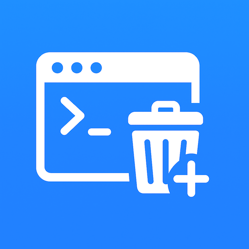

# Console Log Manager



A Visual Studio Code extension to **clear all `console.log` statements** in your file with one shortcut — and to **insert console.log debugging lines** quickly.  
Great for cleaning up code before commits, and for adding debug logs while coding.

---

## ✨ Features

- **Remove debug logs**
  - Clears all `console.log()` statements from the active file.
  - Optionally remove other debug logs (`debug`, `info`, `warn`, `error`) — configurable in settings.
  - Option to also remove **inline** `console.log` calls.
  - Removes empty lines left behind.

- **Insert debug logs**
  - Press a shortcut to insert a `console.log` below the current line.
  - If no text is selected:
    ```js
    console.log("👉🏻 --->| ");
    ```
  - If text (single-line) is selected:
    ```js
    console.log("👉🏻 --->| selected text");
    ```
  - If selected text is a single word (like a variable name):
    ```js
    console.log("👉🏻 --->| variable: ", variable);
    ```

- **Customizable marker**
  - You can configure the prefix (`👉🏻 --->|`) via settings.

---

## ⚙️ Extension Settings

This extension contributes the following settings:

- `consoleLogManager.removeAllDebugLogs`  
  `true | false` — If enabled, removes `debug`, `info`, `warn`, `error` logs in addition to `console.log`.

- `consoleLogManager.removeInlineLogs`  
  `true | false` — If enabled, removes inline `console.log` calls (not just standalone lines).

- `consoleLogManager.customMarker`  
  `string` — Customize the marker inserted in new console.log lines (default: `"👉🏻 --->|"`).

---

## ⌨️ Keyboard Shortcuts

Default keybindings:

| Command                  | Default Shortcut | Description                                |
|--------------------------|------------------|--------------------------------------------|
| **Clear Console Logs**   | `Ctrl+Shift+C`   | Removes console.log (and optionally others) |
| **Insert Console Log**   | `Ctrl+Shift+L`   | Inserts a console.log after the current line |


You can customize these in **File → Preferences → Keyboard Shortcuts**.

---

## 🚀 Usage

1. Open a file in VS Code.
2. Use the keybinding to either:
   - **Remove** all console logs.
   - **Insert** a console log at/after the cursor position (with optional variable/selection handling).
3. Adjust extension settings to match your workflow.

---

## ✨ Change Logs

0.0.3: 
- the added console log line should have the same indentation as the previous line 
- when removing lines with console log, only adjoining lines below should be removed
0.1.0:
- auto insert console.log before every statement, incrementing the index
0.1.1:
- auto insert in try-catch block
- fixed bugs in stacking logs

---

## 🛠️ Development

To run this extension locally:

```bash
# Install dependencies
npm install

# Compile
npm run compile

# Open in Extension Host
code .
